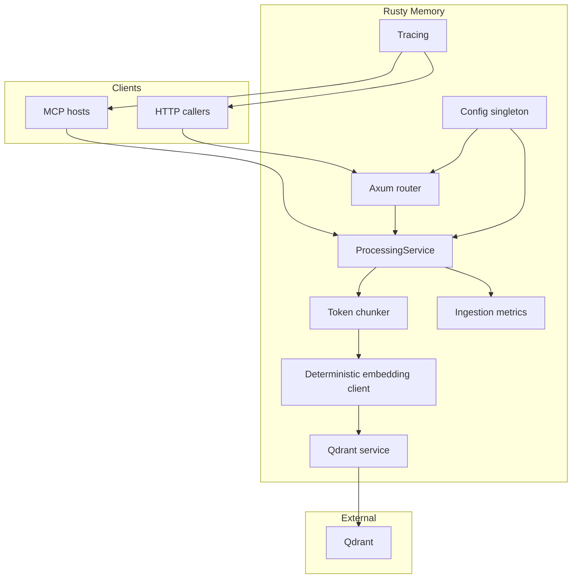

# Rusty Memory

Rusty Memory is a no-fuss memory server for coding agents. We built it after struggling with tools that required complex orchestration, expensive API keys, or weeks of tweaking before you could store a single note. The goal is simple: give hobbyists and developers a drop-in memory stack that works out of the box, keeps costs grounded by treating Ollama as a first-class embedding provider, and stays friendly to anyone just getting started with agentic coding.

## Why this project exists

- **Zero drama setup.** The entire stack is a single Rust binary plus Qdrant. Point your agent at the MCP server or the HTTP API and you can start pushing documents immediately.
- **Local-first embeddings.** Ollama is the default. If you have no cloud keys, you still get embeddings, vector storage, and full agent memory without spending a cent. When you do want hosted models, switch the environment variables and keep rolling.
- **Intentional minimalism.** Every module maps to a single concern—configuration, chunking, embedding, indexing, metrics—so it’s easy to reason about and extend.
- **Friendly automation.** Documentation coverage is enforced, hooks run quickly, and the metrics script offers optional deep dives without getting in your way.

## How it works



1. Clients call either the HTTP API or the MCP tool set.
2. `ProcessingService` picks a model-aware token budget (override with `TEXT_SPLITTER_CHUNK_SIZE` only when you need to fine-tune it).
3. The embedding client produces deterministic vectors (Ollama by default; other providers available via env vars).
4. Chunks and vectors land in Qdrant with UUID identifiers.
5. Metrics record how many documents and chunks have been processed.

## Quick start

1. **Install prerequisites**
   - Rust toolchain (`rustup`), including `rustfmt` and `clippy`.
   - Qdrant (Docker, container, or local install) reachable at `http://127.0.0.1:6333` by default.
   - Optional: Ollama (`brew install ollama` or platform equivalent) for local embeddings.

2. **Clone the repo**
   ```bash
   git clone https://github.com/CaliLuke/rusty-mcp.git
   cd rusty-mcp
   ```

3. **Create a `.env`**
   ```bash
   cp .env.example .env
   # adjust values as needed
   ```

4. **Run the MCP server**
   ```bash
   cargo run --bin rusty_mem_mcp
   ```
   or build once and launch the release binary:
   ```bash
   cargo build --release --bin rusty_mem_mcp
   ./target/release/rusty_mem_mcp
   ```

5. **Run the HTTP server** (optional if you only need MCP)

```bash
cargo run
```

The server listens on `SERVER_PORT` when that variable is set; otherwise it scans `4100-4199` and binds the first available port. Successful `POST /index` calls return `{ "chunks_indexed": <count>, "chunk_size": <tokens> }` so callers can observe the automatic budget.

6. **Point your agent at the server**
   - For Codex CLI (TOML):
     ```toml
     [mcp_servers.rusty_mem]
     command = "/full/path/to/target/release/rusty_mem_mcp"
     cwd = "/full/path/to/rusty-mcp"
     transport = "stdio"

       [mcp_servers.rusty_mem.env]
       QDRANT_URL = "http://127.0.0.1:6333"
       QDRANT_COLLECTION_NAME = "rusty-mem"
       EMBEDDING_PROVIDER = "ollama"
       EMBEDDING_MODEL = "nomic-embed-text"
       EMBEDDING_DIMENSION = "768"
       OLLAMA_ENDPOINT = "http://127.0.0.1:11434"
     ```
   - For JSON-based clients (Kilo, Cline, Roo Code):
     ```json
     {
       "mcpServers": {
         "rusty": {
           "command": "/full/path/to/target/release/rusty_mem_mcp",
           "args": [],
           "cwd": "/full/path/to/rusty-mcp",
           "transport": "stdio",
           "env": {
             "QDRANT_URL": "http://127.0.0.1:6333",
             "QDRANT_COLLECTION_NAME": "rusty-mem",
             "EMBEDDING_PROVIDER": "ollama",
             "EMBEDDING_MODEL": "nomic-embed-text",
             "EMBEDDING_DIMENSION": "768",
             "OLLAMA_ENDPOINT": "http://127.0.0.1:11434"
           }
         }
       }
     }
     ```

   `TEXT_SPLITTER_CHUNK_SIZE` is now optional; the server infers a sensible value from the embedding model when the variable is omitted.

7. **Use the built-in tools**
   - `get-collections` → list available Qdrant collections (`{}` payload).
   - `new-collection` → create or resize (`{ "name": "docs", "vector_size": 768 }`).
   - `push` → ingest (`{ "text": "my note", "collection": "docs" }`). The response echoes `chunksIndexed` and the effective `chunkSize`.
   - `metrics` → check `{ "documentsIndexed": …, "chunksIndexed": … }`.
     When documents have been ingested, the payload also includes `lastChunkSize`.

## Docker Compose example

To get a repeatable local environment, run Qdrant via Docker Compose and launch Rusty Memory on the host:

```yaml
version: "3.8"

services:
  qdrant:
    image: qdrant/qdrant:v1.10.1
    ports:
      - "6333:6333"   # REST API
      - "6334:6334"   # gRPC (optional)
    volumes:
      - qdrant_storage:/qdrant/storage
    restart: unless-stopped

volumes:
  qdrant_storage:
```

Steps:

1. Save the file as `docker-compose.yml` and run `docker compose up -d`.
2. Update `QDRANT_URL` to `http://127.0.0.1:6333` (or the mapped host/port if different).
3. Launch `rusty_mem_mcp` or the HTTP server as shown above.

You can add a `rusty-mem` service that wraps the release binary if you prefer running everything inside Docker, but keeping the server on the host makes it easy to iterate with `cargo run` while Qdrant persists data in the container volume.

## Configuration reference

A detailed explanation of every environment variable, along with agent configuration samples, lives in [docs/configuration.md](docs/configuration.md). It covers:

- All Qdrant and embedding settings.
- Ollama tips for local-only setups.
- JSON vs. TOML MCP snippets for popular tools.
- Log routing and optional overrides.

## HTTP API overview

| Method & Path       | Description                             | Notes                                                                    |
| ------------------- | --------------------------------------- | ------------------------------------------------------------------------ |
| `POST /index`       | Index a document.                       | `text` is required; `collection` falls back to `QDRANT_COLLECTION_NAME`. |
| `GET /collections`  | List Qdrant collections.                | Returns `{ "collections": [string] }`.                                   |
| `POST /collections` | Create or resize a collection.          | Accepts `name` and optional `vector_size`.                               |
| `GET /metrics`      | Inspect ingestion counters.             | Returns document and chunk totals.                                       |
| `GET /commands`     | Machine-readable catalog for MCP hosts. | Lists HTTP commands with sample payloads.                                |

## Development workflow

- Follow the [Engineering Guide](docs/QUALITY_MANUAL.md) for hooks, metrics, and code-quality expectations.
- `./scripts/verify.sh` runs fmt, clippy, tests, and docs.
- `./scripts/metrics.sh` provides optional coverage, complexity, and dependency reports.
- `prek run --all-files` (or `pre-commit run --all-files`) mirrors the commit-time guardrails.

## Roadmap

1. Swap the deterministic embedding stub for provider-backed embeddings via `ai-lib`.
2. Add semantic chunking heuristics to reduce single-chunk documents.
3. Expose a search endpoint and matching MCP tool for similarity queries.
4. Offer Prometheus metrics and richer MCP notifications for observability.

Rusty Memory aims to stay approachable while giving you the building blocks for reliable agent memory. If you have ideas or discover pain points, open an issue—we want the tool to stay delightful for newcomers and power users alike.
