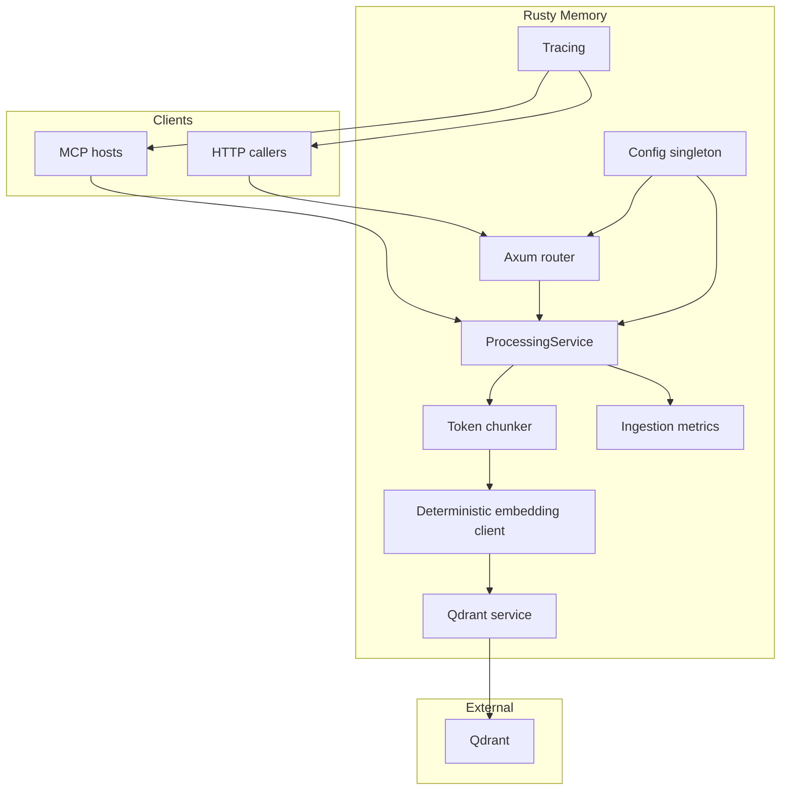

# Rusty Memory MCP

Rusty Memory MCP (crate: `rustymcp`) is a compact memory server for agents. It provides:

- Semantic chunking using `semchunk-rs` with OpenAI‑compatible token counting (`tiktoken-rs`).
- Automatic, model‑aware chunk sizing (overridable when needed).
- Embedding generation via pluggable providers (local by default), with vectors stored in Qdrant.
- Two surfaces: a simple HTTP API and a Model Context Protocol (MCP) stdio server.

## How it works



1. Clients call either the HTTP API or the MCP tool set.
2. The server splits text into semantically coherent chunks using a token budget derived from the embedding model.
3. Embeddings are produced via the configured provider.
4. Chunks + vectors are written to Qdrant.
5. Metrics record documents/chunks processed and the most recent chunk size.

## Quick start

1. **Install prerequisites**
   - Rust toolchain (`rustup`), including `rustfmt` and `clippy`.
   - Qdrant (Docker, container, or local install) reachable at `http://127.0.0.1:6333` by default.
   - Optional: Ollama (`brew install ollama` or platform equivalent) for local embeddings.

2. **Clone the repo**
   ```bash
   git clone https://github.com/CaliLuke/rusty-mcp.git
   cd rusty-mcp
   ```

3. **Create a `.env`**
   ```bash
   cp .env.example .env
   # adjust values as needed
   ```

4. **Install the CLI (recommended)**
   Skip local builds by installing the published binary:
   ```bash
   cargo install rustymcp
   ```
   This places three executables in `~/.cargo/bin`:
   - `rustymcp` → HTTP server entrypoint
   - `rusty_mem_mcp` → MCP stdio server
   - `metrics-post` → helper used by the metrics script

5. **Run the MCP server**
   ```bash
   cargo run --bin rusty_mem_mcp
   ```
   or, if you installed the crate, launch it directly:
   ```bash
   ~/.cargo/bin/rusty_mem_mcp
   ```
   Building from source once also works:
   ```bash
   cargo build --release --bin rusty_mem_mcp
   ./target/release/rusty_mem_mcp
   ```

6. **Run the HTTP server** (optional if you only need MCP)

```bash
cargo run
```

The server listens on `SERVER_PORT` when that variable is set; otherwise it scans `4100-4199` and binds the first available port. Successful `POST /index` calls return `{ "chunks_indexed": <count>, "chunk_size": <tokens> }` so callers can observe the automatic budget.

or, using the installed binary:

```bash
~/.cargo/bin/rustymcp
```

7. **Point your agent at the server**
   - Codex CLI (TOML):
     ```toml
     [mcp_servers.rusty_mem]
     command = "/full/path/to/target/release/rusty_mem_mcp"
     cwd = "/full/path/to/rusty-mcp"
     transport = "stdio"

       [mcp_servers.rusty_mem.env]
       QDRANT_URL = "http://127.0.0.1:6333"
       QDRANT_COLLECTION_NAME = "rusty-mem"
       EMBEDDING_PROVIDER = "ollama"
       EMBEDDING_MODEL = "nomic-embed-text"
       EMBEDDING_DIMENSION = "768"
       OLLAMA_ENDPOINT = "http://127.0.0.1:11434"
     ```
   - JSON-based clients (Kilo, Cline, Roo Code):
     ```json
     {
       "mcpServers": {
         "rusty": {
           "command": "/full/path/to/target/release/rusty_mem_mcp",
           "args": [],
           "cwd": "/full/path/to/rusty-mcp",
           "transport": "stdio",
           "env": {
             "QDRANT_URL": "http://127.0.0.1:6333",
             "QDRANT_COLLECTION_NAME": "rusty-mem",
             "EMBEDDING_PROVIDER": "ollama",
             "EMBEDDING_MODEL": "nomic-embed-text",
             "EMBEDDING_DIMENSION": "768",
             "OLLAMA_ENDPOINT": "http://127.0.0.1:11434"
           }
         }
       }
     }
     ```

   `TEXT_SPLITTER_CHUNK_SIZE` is now optional; the server infers a sensible value from the embedding model when the variable is omitted.

8. **Use the built-in tools**
   - `get-collections` → list available Qdrant collections (`{}` payload).
   - `new-collection` → create or resize (`{ "name": "docs", "vector_size": 768 }`).
   - `push` → ingest (`{ "text": "my note", "collection": "docs" }`). The response echoes `chunksIndexed` and the effective `chunkSize`.
   - `metrics` → check `{ "documentsIndexed": …, "chunksIndexed": … }`.
     When documents have been ingested, the payload also includes `lastChunkSize`.

## HTTP API quick reference

Endpoints (all return JSON on success unless noted):

- `POST /index` – Index a document into the default or provided collection.
  - Request: `{ "text": string, "collection"?: string }`
  - Response: `{ "chunks_indexed": number, "chunk_size": number }`
- `GET /collections` – List Qdrant collections.
- `POST /collections` – Create or resize a collection.
  - Request: `{ "name": string, "vector_size"?: number }`
- `GET /metrics` – Read counters: `{ "documents_indexed": number, "chunks_indexed": number, "last_chunk_size"?: number }`

## Configuration

Most deployments only set: `QDRANT_URL`, `QDRANT_COLLECTION_NAME`, `EMBEDDING_PROVIDER`, `EMBEDDING_MODEL`, and `EMBEDDING_DIMENSION`. See the full reference in [docs/Configuration.md](docs/Configuration.md).

## License

This project is licensed under the [PolyForm Noncommercial License 1.0.0](LICENSE). It is free for noncommercial use. Commercial use is not permitted by this license.

## Contributing

Contributions are welcome via pull requests. Please review the [Quality Manual](docs/QUALITY_MANUAL.md) for code style, testing, and automation expectations.

## Configuration reference

A detailed explanation of every environment variable, along with agent configuration samples, lives in [docs/configuration.md](docs/configuration.md). It covers:

- All Qdrant and embedding settings.
- Ollama tips for local-only setups.
- JSON vs. TOML MCP snippets for popular tools.
- Log routing and optional overrides.

## HTTP API overview

| Method & Path       | Description                             | Notes                                                                    |
| ------------------- | --------------------------------------- | ------------------------------------------------------------------------ |
| `POST /index`       | Index a document.                       | `text` is required; `collection` falls back to `QDRANT_COLLECTION_NAME`. |
| `GET /collections`  | List Qdrant collections.                | Returns `{ "collections": [string] }`.                                   |
| `POST /collections` | Create or resize a collection.          | Accepts `name` and optional `vector_size`.                               |
| `GET /metrics`      | Inspect ingestion counters.             | Returns document and chunk totals.                                       |
| `GET /commands`     | Machine-readable catalog for MCP hosts. | Lists HTTP commands with sample payloads.                                |

## Development workflow

- Follow the [Engineering Guide](docs/QUALITY_MANUAL.md) for hooks, metrics, and code-quality expectations.
- `./scripts/verify.sh` runs fmt, clippy, tests, and docs.
- `./scripts/metrics.sh` provides optional coverage, complexity, and dependency reports.
- `prek run --all-files` (or `pre-commit run --all-files`) mirrors the commit-time guardrails.

## Roadmap

1. Swap the deterministic embedding stub for provider-backed embeddings via `ai-lib`.
2. Add semantic chunking heuristics to reduce single-chunk documents.
3. Expose a search endpoint and matching MCP tool for similarity queries.
4. Offer Prometheus metrics and richer MCP notifications for observability.

Rusty Memory aims to stay approachable while giving you the building blocks for reliable agent memory. If you have ideas or discover pain points, open an issue—we want the tool to stay delightful for newcomers and power users alike.
