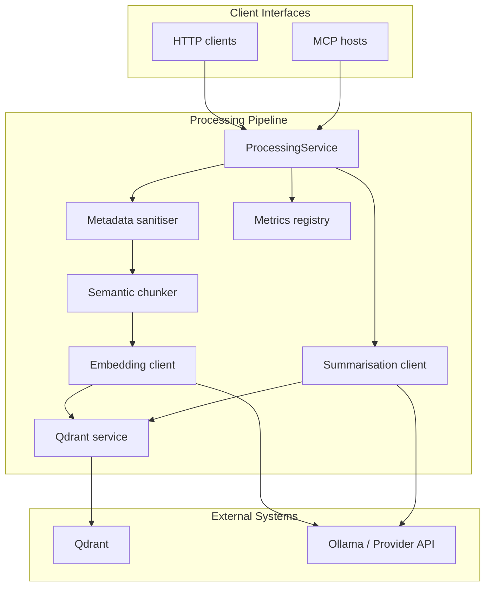

# Rusty Memory Architecture

Rusty Memory ingests raw text, produces semantic chunks with embeddings, and stores both vectors and metadata in Qdrant. The crate ships two primary surfaces:

- **HTTP server (`rustymcp`)** for lightweight scripting.
- **MCP server (`rusty_mem_mcp`)** optimized for editor/agent integrations.

Both surfaces share the same processing layer, so ingestion, search, and summarization behave identically regardless of transport. Live environments typically pair Rusty Memory with Qdrant and Ollama, while tests fall back to deterministic stubs.

## High-level Flow

## Module Summary

| Module / File           | Responsibility                                                                                                                                               |
| ----------------------- | ------------------------------------------------------------------------------------------------------------------------------------------------------------ |
| `config`                | Loads environment variables once and exposes a typed `Config`. Ensures derived defaults (chunk size, ports) are available globally.                          |
| `logging`               | Configures `tracing` subscribers for stdout and optional file sinks.                                                                                         |
| `api`                   | Axum HTTP surface exposing ingestion, collection management, metrics, and a discovery catalogue.                                                             |
| `processing::service`   | Orchestrates ingestion, search, and summarisation on behalf of HTTP/MCP callers. Owns the embedding client, Qdrant client, and metrics registry.             |
| `processing::chunking`  | Token-aware chunker that selects window sizes based on provider/model (with overrides).                                                                      |
| `processing::sanitize`  | Normalises metadata (`project_id`, `memory_type`, `tags`, `source_uri`) and validates MCP payloads.                                                          |
| `processing::mappers`   | Dedupe helpers, payload builders, and response mappers for Qdrant scored points.                                                                             |
| `processing::summarize` | Extractive fallback, abstractive prompt construction, summary key derivation, and provenance tracking.                                                       |
| `processing::types`     | Shared DTOs covering ingestion outcomes, search requests/results, and health checks.                                                                         |
| `embedding`             | Embedding client factory supporting Ollama (live) with a deterministic fallback used in tests and offline modes.                                             |
| `summarization`         | Summarisation client factory mirroring the embedding setup (Ollama by default, deterministic fallback otherwise).                                            |
| `qdrant::client`        | Lightweight REST wrapper for collections, upserts, filtered search, and payload index bootstrapping.                                                         |
| `qdrant::filters`       | Builders for Qdrant filters (project, memory type, tags, timestamp).                                                                                         |
| `qdrant::payload`       | Universal payload construction (payload schema, chunk hashes, timestamps) and index summaries.                                                               |
| `qdrant::types`         | Request/response structs mirroring the Qdrant REST shape.                                                                                                    |
| `mcp/*`                 | MCP server implementation: tool schemas, format helpers, per-tool handlers (`index`, `search`, `summarize`, `metrics`, `collections`), and server bootstrap. |
| `metrics`               | Atomic counters reporting documents, chunks, and last chunk size. Shared across surfaces.                                                                    |
| `src/bin/*`             | Entry points (`rustymcp`, `rusty_mem_mcp`, `metrics_post`).                                                                                                  |

## Ingestion Pipeline

1. **Configuration** – `ProcessingService::new` loads `Config`, ensures the primary collection exists, and provisions payload indexes (`project_id`, `memory_type`, `tags`, `timestamp`, `chunk_hash`).
2. **Metadata sanitisation** – `ProcessingService::process_and_index` trims user-provided metadata, defaults missing values (`project_id = "default"`, `memory_type = "semantic"`), and coerces tags into a deduplicated array.
3. **Chunking** – `determine_chunk_size` picks a window and overlap based on provider/model or explicit overrides. `chunk_text` produces token-aware chunks while tracking chunk size.
4. **Embedding** – `EmbeddingClient` either calls Ollama (when configured) or uses the deterministic fallback to guarantee test reproducibility. The client enforces vector length consistency.
5. **Qdrant upsert** – Payloads include UUID `memory_id`, source metadata, RFC3339 timestamps, and SHA-256 `chunk_hash`. Inserts return `inserted`, `updated`, and `skipped_duplicates` counters.
6. **Metrics** – `CodeMetrics` increments document/chunk totals and records the effective chunk size, making MCP/HTTP metrics consistent.

## Search Pipeline

1. **Request normalisation** – MCP handlers coerce aliases (`project`, `type`, `k`) and scalar tags into the canonical `SearchRequest`.
2. **Validation** – The request must include non-empty `query_text`; optional filters are range-checked (`limit`, `score_threshold`, timestamps).
3. **Embedding the query** – The same embedding client generates the search vector, guaranteeing dimension alignment with stored points.
4. **Filter construction** – `qdrant::filters::build_search_filter` composes payload filters based on project, memory type, tags (contains-any), and optional time range.
5. **Qdrant search** – `QdrantService::search_points` issues the REST query with limit/threshold hints.
6. **Response formatting** – `map_scored_point` builds `SearchHit`s that include metadata, score, and citation snippets. MCP responses also assemble a prompt-ready `context` string and echo applied filters.

## Summarisation Pipeline

1. **Argument normalisation** – The MCP `summarize` handler requires an explicit `time_range` with both `start` and `end` (RFC3339). It coerces tags and tolerates scalar project/memory values.
2. **Source retrieval** – A secondary search fetches candidate episodic memories within the requested window; results are ordered by timestamp.
3. **Summary strategy** – When abstractive summarisation is available, the handler crafts a prompt containing the ordered memories, project context, and requested `summary_key`. When not, an extractive fallback concatenates key sentences under the configured word budget.
4. **Persistence** – Successful summaries are re-ingested via the processing pipeline with `memory_type = "semantic"`, provenance (`source_memory_ids`), and a deterministic `summary_key` tag so replays are idempotent.

## MCP Surface

Rusty Memory exposes the following tools/resources through the MCP server:

- Tools: `push`/`index`, `search`, `summarize`, `get-collections`, `new-collection`, `metrics`.
- Resources: `memory-types`, `projects`, `projects/{project_id}/tags`, `health`, `settings`, `usage`.

Each tool shares the `ProcessingService` instance, keeping behaviour aligned across transports and ensuring live validation exercises the full pipeline.

## HTTP Surface

The HTTP API focuses on ingestion and operations automation:

| Method & Path       | Description                                                                       |
| ------------------- | --------------------------------------------------------------------------------- |
| `POST /index`       | Chunk, embed, and index text with optional metadata and collection overrides.     |
| `GET /collections`  | List managed Qdrant collections.                                                  |
| `POST /collections` | Create or resize a collection (vector size inferred from config unless provided). |
| `GET /metrics`      | Return document/chunk counters and the last chunk size.                           |
| `GET /commands`     | Machine-readable catalogue describing the available HTTP endpoints.               |

Search and summarisation are currently exposed only via MCP where most agent clients reside.

## Quality Gates

- `scripts/verify.sh` orchestrates formatting, clippy, doc builds, and tests. Git hooks call `prek run`, which mirrors the CI fast path.
- `tests/mcp_integration.rs` spins up a mock Qdrant server and validates MCP tool discovery, ingestion, search responses, and error ergonomics.
- `tests/live_validation.rs` exercises the pipeline against live Qdrant/Ollama when those services are reachable.
- The crate opts into `#![deny(missing_docs)]` for public APIs and forbids `unsafe` code.

## Future Enhancements

- Switch the Qdrant client to gRPC (`qdrant-client`) once performance data justifies the migration.
- Expand observability with Prometheus exporters and richer tracing spans for summarisation.
- Investigate adaptive chunking based on document structure and token usage telemetry.
