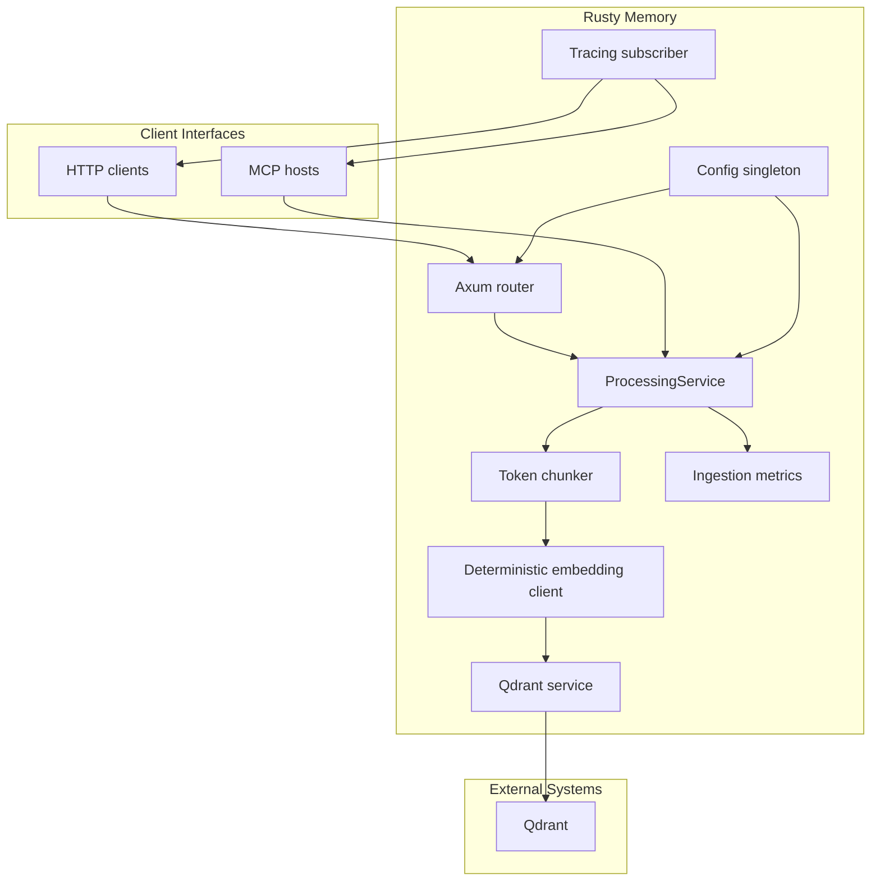

# Rusty Memory Architecture

Rusty Memory is a Rust application that ingests plain-text documents, splits them into fixed-size chunks, produces deterministic embeddings, and stores the vectors in Qdrant. The project exposes the functionality both as an HTTP API and as a Model Context Protocol (MCP) server.

## High-level Flow

## Module Summary

| Module                | Responsibility                                                                                                    |
| --------------------- | ----------------------------------------------------------------------------------------------------------------- |
| `config`              | Loads environment-driven settings through `OnceLock` and exposes `Config`.                                        |
| `logging`             | Sets up `tracing` subscribers, optionally writing to `RUSTY_MEM_LOG_FILE` or `logs/rusty-mem.log`.                |
| `api`                 | Provides the Axum router and HTTP handlers for indexing, collection management, metrics, and the command catalog. |
| `processing`          | Coordinates chunking, embedding, Qdrant operations, and ingestion metrics.                                        |
| `embedding`           | Supplies a deterministic embedding client placeholder powered by project configuration.                           |
| `qdrant`              | Wraps REST calls to Qdrant for collection management and point indexing.                                          |
| `metrics`             | Holds atomic counters tracking ingested documents and chunks.                                                     |
| `mcp`                 | Implements the MCP server (`RustyMemMcpServer`) and tool dispatch.                                                |
| `bin/metrics_post.rs` | Post-processing helper used by `scripts/metrics.sh` to summarise analyzer outputs.                                |

## Document Processing Pipeline

1. Configuration is loaded once via `config::init_config()`; subsequent reads use the cached instance.
2. The HTTP server binds to `SERVER_PORT` when provided or the first free port in `4100-4199`.
3. `ProcessingService::process_and_index` performs the ingestion steps:
   - Split the document with `semchunk_rs::Chunker` using the configured token budget (`TEXT_SPLITTER_CHUNK_SIZE`). The chunker counts whitespace-delimited tokens and does not yet apply semantic grouping.
   - Generate deterministic embeddings for each chunk through `embedding::AiLibClient`. The current implementation hashes bytes into a normalised vector of length `EMBEDDING_DIMENSION`.
   - Ensure the target Qdrant collection exists (`QdrantService::create_collection_if_not_exists`) and upload the chunks with randomly generated UUIDs.
   - Update the `CodeMetrics` counters with the number of documents and chunks processed.
4. The MCP server reuses the same processing service instance, so the chunking and storage behaviour is identical across interfaces.

## Interfaces

### HTTP API

| Method & Path       | Description                                               | Request Body                                 | Success Response                                                           |
| ------------------- | --------------------------------------------------------- | -------------------------------------------- | -------------------------------------------------------------------------- |
| `POST /index`       | Index a document into the default or provided collection. | `{ "text": string, "collection"?: string }`  | `200 OK` with empty JSON body.                                             |
| `GET /collections`  | List available Qdrant collections.                        | _None_                                       | `200 OK` with `{ "collections": [string] }`.                               |
| `POST /collections` | Create or resize a collection.                            | `{ "name": string, "vector_size"?: number }` | `200 OK` with empty JSON body.                                             |
| `GET /metrics`      | Read cumulative ingestion counters.                       | _None_                                       | `200 OK` with `{ "documents_indexed": number, "chunks_indexed": number }`. |
| `GET /commands`     | Provide a machine-readable command catalog for MCP hosts. | _None_                                       | `200 OK` with structured command descriptors.                              |

All handlers return `500 Internal Server Error` with a descriptive message when the processing pipeline fails.

### MCP Tools

`RustyMemMcpServer` advertises four tools:

| Tool              | Purpose                                                    | Parameters                                                    | Structured Result                                                   |
| ----------------- | ---------------------------------------------------------- | ------------------------------------------------------------- | ------------------------------------------------------------------- |
| `push`            | Index a document.                                          | `{ "text": string, "collection"?: string }` (required `text`) | `{ "status": "ok", "collection": string, "chunksIndexed": number }` |
| `get-collections` | List Qdrant collections.                                   | `{}`                                                          | `{ "collections": [string] }`                                       |
| `new-collection`  | Create or update a collection with a specific vector size. | `{ "name": string, "vector_size"?: number }`                  | `{ "status": "ok", "vectorSize": number }`                          |
| `metrics`         | Return ingestion counters.                                 | `{}`                                                          | `{ "documentsIndexed": number, "chunksIndexed": number }`           |

During `initialize`, the server shares usage instructions that mirror the four-step workflow above.

## Configuration

| Environment Variable       | Details                                                                                 |
| -------------------------- | --------------------------------------------------------------------------------------- |
| `QDRANT_URL`               | Base URL of the Qdrant REST API (e.g. `http://127.0.0.1:6333`).                         |
| `QDRANT_COLLECTION_NAME`   | Default collection for `push` operations.                                               |
| `QDRANT_API_KEY`           | Optional API key forwarded via the `api-key` header.                                    |
| `EMBEDDING_PROVIDER`       | Logical provider name (`ollama` or `openai`); stored for logging only today.            |
| `EMBEDDING_MODEL`          | Free-form model identifier included in logging.                                         |
| `EMBEDDING_DIMENSION`      | Vector dimension used when creating collections and generating embeddings.              |
| `TEXT_SPLITTER_CHUNK_SIZE` | Maximum token count for each chunk (whitespace-delimited).                              |
| `SERVER_PORT`              | Optional fixed port for the HTTP server.                                                |
| `RUSTY_MEM_LOG_FILE`       | When set, directs structured logs to the provided path instead of `logs/rusty-mem.log`. |

The configuration module also honours provider-specific environment variables consumed by downstream tooling (for example, `OPENAI_API_KEY`).

## Observability

- **Logging:** `logging::init_tracing` installs a compact formatter to stdout and an optional non-blocking file appender. Log level defaults to `info` and respects `RUST_LOG` if provided.
- **Metrics:** `metrics::CodeMetrics` exposes `metrics_snapshot`, and the MCP `metrics` tool returns the same data. There is no Prometheus exporter yet.
- **Reports:** `scripts/metrics.sh` can generate snapshots for coverage, complexity, debtmap, unused dependencies, and LOC. When `METRICS_SOFT=1`, outputs are written to a temporary directory; manual runs populate `reports/`.

## Quality Gates

- Documentation coverage is enforced via `#![deny(missing_docs)]`; missing Rustdoc blocks builds.
- The verification script (`scripts/verify.sh`) runs formatting, clippy, tests, and doc builds. The Git hooks invoke this suite on every push, and a reduced version on commit.
- The MCP integration test (`tests/mcp_integration.rs`) exercises initialization, tool listing, successful indexing, and validation of input errors.
- The crate forbids `unsafe` code through policy; the geiger hook can be run manually if additional validation is required.

## Future Enhancements

- Replace the deterministic embedding stub with real provider calls using `ai-lib` transports.
- Introduce semantics-aware chunking or adaptive chunk sizes to improve retrieval quality.
- Add a search endpoint and a corresponding MCP tool that perform vector similarity queries against Qdrant.
- Extend observability with Prometheus metrics and structured error notifications over MCP.
